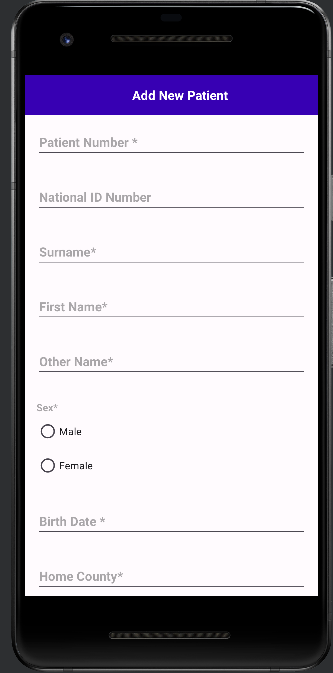

# Appointment Management App

# Introduction
This is a simple Appointment management meant for managing Patient appoints at a health facility.
The System is able to register new patient and add appointments for the patient.

# Features
This app has the following features
1. It enables user to Register a new patient
2. It enables user to Add new appointment for the patient

## Pre-requisite
1. Install Java 18 installed
2. Install Android Studio or [download it from here](https://developer.android.com/studio/index.html)

## Installation Devises
1. Use a physical Android device to run the app
2. Use the Android Emulator that comes with the Android Studio on installation (It is slow )

# Installation
```agsl
    Clone repo: https://github.com/Ogollah/AppointmentManager.git
    Import to Android Studio
    Run the app / Build APK
    Run on Physical Android Device or Emulator
```

## ScreenShots
### Add Patient



### Add Appointment

